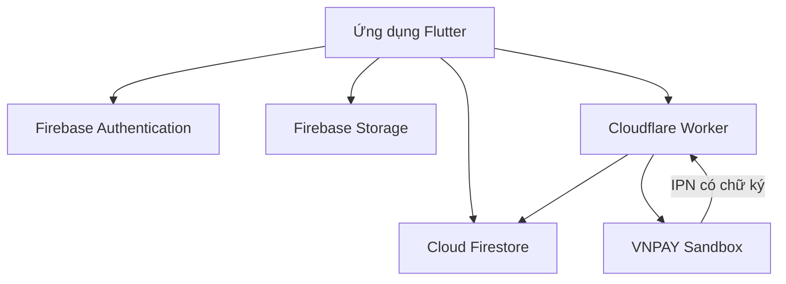

# Kiến trúc và thiết kế dữ liệu

## Kiến trúc tổng thể

Cloudflare Worker giữ bí mật tích hợp VNPAY, tạo URL thanh toán, kiểm tra chữ ký IPN và cập nhật trạng thái thanh toán. Ứng dụng Flutter không lưu Secret Key.

## Các collection Firestore chính

| Collection | Mục đích | Trường quan trọng |
|---|---|---|
| `users` | Hồ sơ khách hàng | `name`, `email`, `phone`, `createdAt` |
| `admins` | Xác định quyền quản trị | ID document chính là UID admin |
| `services` | Danh mục dịch vụ do admin quản lý | `name`, `price`, `durationMinutes`, `isActive` |
| `employees` | Nhân viên từng chi nhánh | `salonId`, `name`, `rating`, `skills`, `isActive` |
| `bookings` | Lịch hẹn và bản chụp dịch vụ tại thời điểm đặt | `userId`, `salonId`, `services`, `appointmentAt`, `status`, `payment` |
| `booking_slots` | Khóa các khoảng thời gian của thợ | `barberId`, `slotTime`, `bookingId` |
| `payment_orders` | Đơn thanh toán phía máy chủ | `bookingId`, `amount`, `status`, `transactionNo` |
| `voucher_templates` | Mã ưu đãi chung | `code`, `discountPercent`, `usageLimit`, `usedCount` |
| `users/{uid}/vouchers` | Voucher tích lũy cá nhân | `rewardType`, `discountPercent`, `isUsed` |
| `reviews` | Đánh giá sau lịch hoàn thành | `bookingId`, `barberRating`, `salonRating`, `comment` |
| `announcements` | Thông báo do admin tạo | `title`, `message`, `salonId`, `createdAt` |
| `support_chats` | Hội thoại khách hàng-admin | `userId`, `lastMessage`, `updatedAt` |
| `hairstyles` | Mẫu tóc | `name`, `description`, `imageUrl`, `isActive` |
| `app_settings` | Hotline và chính sách tích lũy | cấu hình theo từng document |

Chi nhánh có dữ liệu mặc định trong ứng dụng để phục vụ demo. Hotline và dịch vụ được ghi đè bằng cấu hình Firestore.

## Quan hệ logic

- Một người dùng có nhiều lịch hẹn.
- Một chi nhánh có nhiều nhân viên và lịch hẹn.
- Một lịch hẹn chứa nhiều dịch vụ; tên, giá và thời lượng được lưu dạng bản chụp để lịch cũ không đổi khi admin sửa giá.
- Một lịch hẹn chỉ thuộc một nhân viên sau khi hệ thống phân công.
- Một lịch hoàn thành có tối đa một đánh giá.
- Một voucher chung có nhiều lượt sử dụng nhưng mỗi người chỉ được sử dụng một lần.

## Luồng VNPAY

1. Khách chọn “Thanh toán ngay”.
2. Flutter yêu cầu Worker tạo URL VNPAY cho booking đang chờ thanh toán.
3. Khách thực hiện giao dịch trên VNPAY Sandbox.
4. VNPAY gửi IPN về Worker.
5. Worker xác minh chữ ký, số tiền và mã đơn, sau đó cập nhật Firestore.
6. Booking đã thanh toán được xác nhận tự động và hai phía nhìn thấy trạng thái mới theo thời gian thực.

## Kiểm thử đề xuất khi nghiệm thu

| Nhóm | Trường hợp |
|---|---|
| Tài khoản | đăng ký sai số điện thoại, đăng nhập sai, quên mật khẩu |
| Đặt lịch | chọn nhiều dịch vụ, thợ bất kỳ, trùng khung giờ |
| Thanh toán | IPN sai chữ ký, sai số tiền, giao dịch thành công |
| Voucher | hết lượt, hết hạn, không đủ giá trị đơn, dùng trùng |
| Phân quyền | khách không thể sửa dịch vụ/lịch của người khác |
| Giao diện | điện thoại nhỏ, web ngang, dữ liệu trống, mất mạng |
